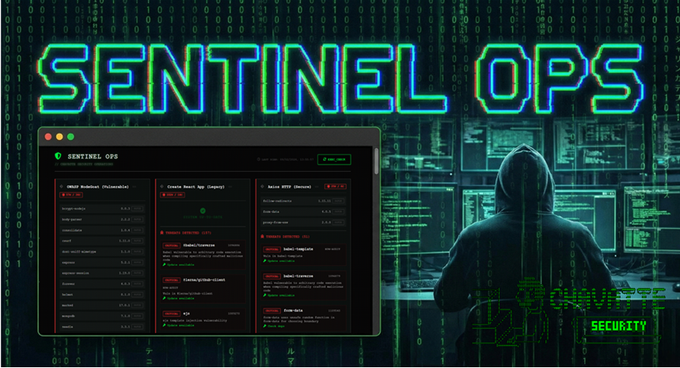

<pre style="font-size: 0.6rem;">

                              \\\\\\
                           \\\\\\\\\\\\
                          \\\\\\\\\\\\\\\
-------------,-|           |C>   // )\\\\|    .o88b. db   db  .d8b.  db    db  .d8b.  d888888b d888888b d88888b
           ,','|          /    || ,'/////|   d8P  Y8 88   88 d8' '8b 88    88 d8' '8b '~~88~~' '~~88~~' 88'  
---------,','  |         (,    ||   /////    8P      88ooo88 88ooo88 Y8    8P 88ooo88    88       88    88ooooo 
         ||    |          \\  ||||//''''|    8b      88~~~88 88~~~88 '8b  d8' 88~~~88    88       88    88~~~~~ 
         ||    |           |||||||     _|    Y8b  d8 88   88 88   88  '8bd8'  88   88    88       88    88.   
         ||    |______      ''''\____/ \      'Y88P' YP   YP YP   YP    YP    YP   YP    YP       YP    Y88888P
         ||    |     ,|         _/_____/ \
         ||  ,'    ,' |        /          |                 ___________________________________________
         ||,'    ,'   |       |         \  |              / \                                           \ 
_________|/    ,'     |      /           | |             |  |  A P I                                     | 
_____________,'      ,',_____|      |    | |              \ |      Portfolio Chavatte                    | 
             |     ,','      |      |    | |                |                        chavatte.42web.io   | 
             |   ,','    ____|_____/    /  |                |    ________________________________________|___
             | ,','  __/ |             /   |                |  /                                            /
_____________|','   ///_/-------------/   |                 \_/____________________________________________/ 
              |===========,'                                    
			  

</pre>

<div align="center">



# 🛡️ Sentinel Ops

</div>

> **Chavatte Security Operations Center** > Universal Vulnerability & Dependency Monitor for Node.js Projects

[](README.pt-br.md)


**Sentinel Ops** is a continuous security audit tool designed for Home Labs, CasaOS servers, and DevOps/SecOps teams. It automatically monitors your Git repositories, checks for outdated dependencies, and alerts on security vulnerabilities (CVEs/GHSAs) via a responsive Cyberpunk interface.

---

## ✨ Features

* **🕵️‍♂️ Universal:** Automatically detects and audits **NPM**, **Yarn (Classic & Berry v4+)**, and **PNPM** projects.
* **📡 OSV-Scanner Integration:** Powered by Google's OSV database to detect cross-ecosystem vulnerabilities missed by native audits.
* **🎯 Threat Intel:** Built-in intelligent links direct you to the exact advisory (NIST NVD, GitHub Advisories, OSV) for quick mitigation.
* **⚡ Ultra Fast (Sparse Checkout):** Does not clone the entire repo. Only downloads manifest files (`package.json`, `lockfiles`), saving bandwidth and storage.
* **🔒 Secure:** Runs in an isolated container with no write access to the remote repository.
* **🖥️ Visual Dashboard:** Responsive Web UI with Dark Mode, real-time updates, Source Badges, and risk details.
* **🐳 Docker Native:** Ready for Docker Compose, CasaOS, or Portainer.
* **🔑 Hybrid Support:** Works with private repositories (via SSH) and public ones (via HTTPS).

---

## 🚀 Quick Install (Docker Compose)

### 1. Folder Structure

Create a project folder with the following structure:

```text
/sentinel-ops
├── docker-compose.yml
├── ssh/                # (Optional) Your private SSH keys
└── config/
    └── repos.yml       # Repository list
```


### 2. Configuration (`docker-compose.yml`)

**YAML**

```
version: "3.8"
services:
  sentinel-ops:
    image: chavatte/sentinel-ops:latest
    container_name: sentinel-ops
    restart: unless-stopped
    ports:
      - "8080:8080"
    dns:
      - 8.8.8.8
      - 1.1.1.1
    environment:
      - SCAN_INTERVAL=21600 # Time in seconds (6 hours)
      - TZ=America/Sao_Paulo
    volumes:
      - ./config/repos.yml:/config/repos.yml:ro
      - ./ssh:/ssh:ro
      - sentinel_data:/data

volumes:
  sentinel_data:
```

### 3. Defining Repositories (`config/repos.yml`)

Create `config/repos.yml`. You can mix private and public repos.

**YAML**

```
repos:
  # 🔐 Private Repo (Requires key in ./ssh folder)
  - id: my-saas
    name: "My Private SaaS"
    git: git@github.com:user/secret-project.git
    ssh_key: /ssh/id_rsa

  # 🌍 Public Repo (No key needed)
  - id: react-core
    name: "React (Open Source)"
    git: [https://github.com/facebook/react.git](https://github.com/facebook/react.git)
```

### 4. Running

**Bash**

```
docker compose up -d
```

Access dashboard at: `http://localhost:8080`

---

## 🔑 SSH Configuration (For Private Repos)

If you need to audit private repositories (GitHub, GitLab, Bitbucket):

1. Copy your private key (e.g., `id_rsa`) to the `./ssh` folder you created.
2. In `repos.yml`, the `ssh_key` field must point to `/ssh/filename`.
3. **Security:** Sentinel Ops copies your key to a secure temporary area and applies restricted permissions (`chmod 600`) automatically during execution.

> **Note:** No `known_hosts` configuration required. The system automatically accepts server fingerprints for easier container usage.

---

## 🛠️ Development (Manual)

To run outside Docker or contribute:

**Prerequisites:** Python 3.11+, Git, Node.js, Corepack (Yarn/PNPM), and OSV-Scanner installed.

1. Clone this repository.
2. Install Python dependencies:
   **Bash**

   ```
   pip install -r requirements.txt
   ```
3. Set env vars and run:
   **Bash**

   ```
   export CONFIG_FILE="./config/repos.yml"
   python3 src/main.py
   ```

---

## 📝 License

This project is distributed under the **MIT** license.
See the `LICENSE` file for details.

---

<div align="center">

<b>CHAVATTE SECURITY</b>

Developed by <a href="https://github.com/chavatte">DevChavatte</a>

</div>
