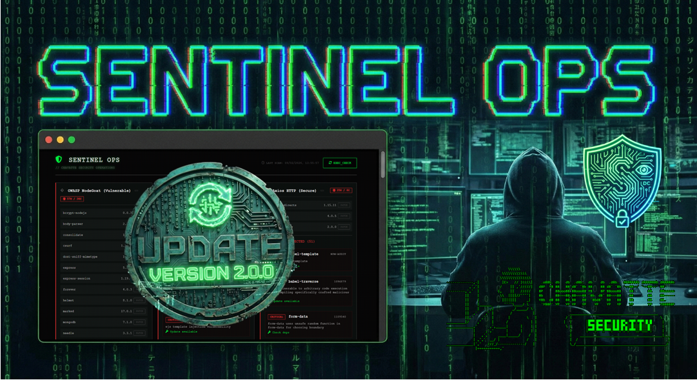

<pre style="font-size: 0.5rem;">

                              \\\\\\
                           \\\\\\\\\\\\
                          \\\\\\\\\\\\\\\
-------------,-|           |C>   // )\\\\|    .o88b. db   db  .d8b.  db    db  .d8b.  d888888b d888888b d88888b
           ,','|          /    || ,'/////|   d8P  Y8 88   88 d8' '8b 88    88 d8' '8b '~~88~~' '~~88~~' 88'  
---------,','  |         (,    ||   /////    8P      88ooo88 88ooo88 Y8    8P 88ooo88    88       88    88ooooo 
         ||    |          \\  ||||//''''|    8b      88~~~88 88~~~88 '8b  d8' 88~~~88    88       88    88~~~~~ 
         ||    |           |||||||     _|    Y8b  d8 88   88 88   88  '8bd8'  88   88    88       88    88.   
         ||    |______      ''''\____/ \      'Y88P' YP   YP YP   YP    YP    YP   YP    YP       YP    Y88888P
         ||    |     ,|         _/_____/ \
         ||  ,'    ,' |        /          |                 ___________________________________________
         ||,'    ,'   |       |         \  |              / \                                           \ 
_________|/    ,'     |      /           | |             |  |                                            | 
_____________,'      ,',_____|      |    | |              \ |      chavatte@duck.com                     | 
             |     ,','      |      |    | |                |                       chavatte.vercel.app  | 
             |   ,','    ____|_____/    /  |                |    ________________________________________|___
             | ,','  __/ |             /   |                |  /                                            /
_____________|','   ///_/-------------/   |                 \_/____________________________________________/ 
              |===========,'                                                                                  
			  

</pre>

<div align="center">



# 🛡️ Sentinel Ops

</div>

> **Chavatte Security Operations Center** <br>
> Advanced Threat Intelligence & Vulnerability Monitor for Node.js Ecosystems

[](README.pt-br.md)


**Sentinel Ops** is a continuous security audit and Threat Intelligence tool designed for Home Labs, CasaOS servers, and DevSecOps teams. It automatically monitors Git repositories, audits dependency trees, and alerts on security vulnerabilities (CVEs/GHSAs) via a responsive Cyberpunk HUD.

---

## ✨ Key Features

* **🕵️‍♂️ Universal Compatibility:** Seamlessly detects and audits **NPM**, **Yarn (Classic & Berry v4+)**, and **PNPM** environments.
* **🌐 OSV-Scanner Integration:** Performs deep complementary scans using Google's `OSV.dev` database, capturing threats that bypass native package manager audits.
* **🎯 Dynamic Threat Intel:** Vulnerability cards automatically generate clickable links to official mitigation reports (NIST NVD, GitHub Advisories, OSV).
* **📄 Threat Report Export:** Instantly generate tactical Markdown (`.md`) reports containing an Executive Summary and an Exploitation Map for Red/Blue teams.
* **⚡ Ultra Fast (Sparse Checkout):** Does not clone the entire repo. Only downloads manifest files (`package.json`, lockfiles) securely into isolated memory.
* **🖥️ Cyberpunk HUD UI:** Real-time visual dashboard with Glassmorphism, Dual-Badge telemetry, and risk-based intelligent sorting.
* **🔑 Hybrid Support:** Works natively with private repositories (via SSH) and public ones (via HTTPS).

---

## 🚀 Quick Install (Docker Compose)

### 1. Folder Structure

Create a project folder with the following structure:

```text
/sentinel-ops
├── docker-compose.yml
├── ssh/                # (Optional) Your private SSH keys
└── config/
    └── repos.yml       # Repository list
```

### 2. Configuration (`docker-compose.yml`)

**YAML**

```
version: "3.8"
services:
  sentinel-ops:
    image: chavatte/sentinel-ops:latest
    container_name: sentinel-ops
    restart: unless-stopped
    ports:
      - "9393:8080"
    dns:
      - 8.8.8.8
      - 1.1.1.1
    environment:
      - SCAN_INTERVAL=21600 # Time in seconds (6 hours)
      - TZ=America/Sao_Paulo
    volumes:
      - ./config/repos.yml:/config/repos.yml:ro
      - ./ssh:/ssh:ro
      - sentinel_data:/data

volumes:
  sentinel_data:
```

### 3. Defining Repositories (`config/repos.yml`)

You can mix private and public repos dynamically.

**YAML**

```
repos:
  # 🔐 Private Repo (Requires key in ./ssh folder)
  - id: my-saas
    name: "My Private SaaS"
    git: git@github.com:user/secret-project.git
    ssh_key: /ssh/id_rsa

  # 🌍 Public Repo (No key needed)
  - id: react-core
    name: "React (Open Source)"
    git: https://github.com/facebook/react.git
```

### 4. Running

**Bash**

```
docker-compose up -d
```

Access your SecOps Dashboard at: `http://localhost:9393`

---

## 🛡️ SecOps Transparency & Docker Image Security

As a security-centric tool, Sentinel Ops maintains strict transparency regarding its own container supply chain. If you scan our Docker image using tools like Docker Scout or Trivy, you may notice some flagged CVEs. These are mapped and classified as  **Accepted Third-Party Risks** :

* **Google OSV-Scanner (`golang` vulnerabilities):** We fetch the latest official compiled `osv-scanner` binary directly from Google's releases. Any Golang-related CVEs flagged within this binary are upstream dependencies managed by Google.
* **Alpine & NPM (`tar`, `minimatch`, etc.):** Our foundation uses the hardened `python:3.14-alpine` and forces global NPM updates to minimize attack surfaces. However, some transient dependencies tied to the OS package manager ecosystem might trigger low/moderate alerts.

*Rest assured: Sentinel Ops runs strictly in isolated sub-processes. These upstream flags do not compromise your remote repositories or the integrity of your host server.*

---

## 🔑 SSH Configuration (For Private Repos)

If you need to audit private repositories (GitHub, GitLab, Bitbucket):

1. Copy your private key (e.g., `id_rsa`) to the `./ssh` folder.
2. In `repos.yml`, the `ssh_key` field must point to `/ssh/filename`.
3. **Security:** Sentinel Ops copies your key to a secure temporary area and applies restricted permissions (`chmod 600`) automatically during execution.
4. *No `known_hosts` manual configuration required.*

---

## 🛠️ Development (Manual)

To run outside Docker or contribute:

**Prerequisites:** Python 3.11+, Git, Node.js, Yarn, NPM, and PNPM installed.

**Bash**

```
# 1. Clone this repository
git clone https://github.com/chavatte/sentinel-ops.git

# 2. Install Python dependencies
pip install -r requirements.txt

# 3. Set env vars and run
export CONFIG_FILE="./config/repos.yml"
python3 src/main.py
```

---

## 📝 License

This project is distributed under the **MIT** license.
See the `LICENSE` file for details.

---

CHAVATTE SECURITY

Developed by @DevChavatte