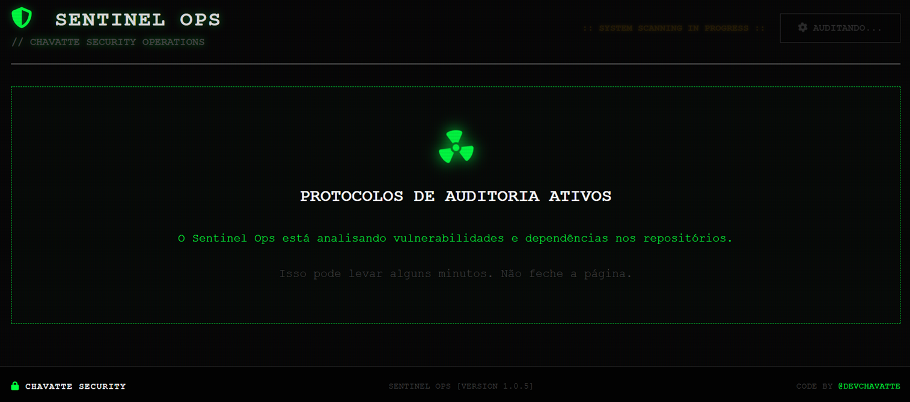
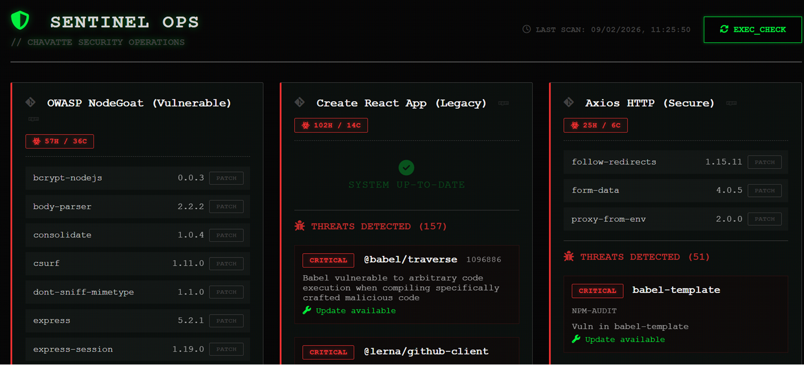
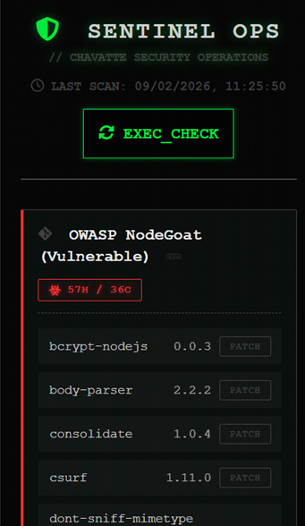
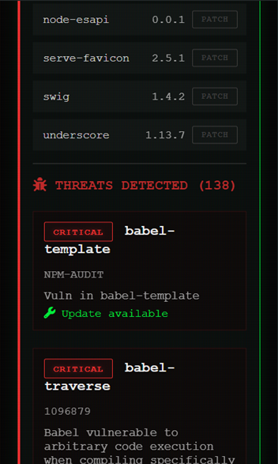

<pre style="font-size: 0.6rem;">

                              \\\\\\
                           \\\\\\\\\\\\
                          \\\\\\\\\\\\\\\
-------------,-|           |C>   // )\\\\|    .o88b. db   db  .d8b.  db    db  .d8b.  d888888b d888888b d88888b
           ,','|          /    || ,'/////|   d8P  Y8 88   88 d8' '8b 88    88 d8' '8b '~~88~~' '~~88~~' 88'  
---------,','  |         (,    ||   /////    8P      88ooo88 88ooo88 Y8    8P 88ooo88    88       88    88ooooo 
         ||    |          \\  ||||//''''|    8b      88~~~88 88~~~88 '8b  d8' 88~~~88    88       88    88~~~~~ 
         ||    |           |||||||     _|    Y8b  d8 88   88 88   88  '8bd8'  88   88    88       88    88.   
         ||    |______      ''''\____/ \      'Y88P' YP   YP YP   YP    YP    YP   YP    YP       YP    Y88888P
         ||    |     ,|         _/_____/ \
         ||  ,'    ,' |        /          |                 ___________________________________________
         ||,'    ,'   |       |         \  |              / \                                           \ 
_________|/    ,'     |      /           | |             |  |  A P I                                     | 
_____________,'      ,',_____|      |    | |              \ |      Portfolio Chavatte                    | 
             |     ,','      |      |    | |                |                        chavatte.42web.io   | 
             |   ,','    ____|_____/    /  |                |    ________________________________________|___
             | ,','  __/ |             /   |                |  /                                            /
_____________|','   ///_/-------------/   |                 \_/____________________________________________/ 
              |===========,'                                  
			  

</pre>

<div align="center">


# 🛡️ Sentinel Ops

</div>

> **Chavatte Security Operations Center** > Monitor de Vulnerabilidades e Dependências Universal para Projetos Node.js


O **Sentinel Ops** é uma ferramenta de auditoria de segurança contínua projetada para Home Labs, servidores CasaOS e equipes de SecOps/DevOps. Ele monitora automaticamente seus repositórios Git, verifica dependências desatualizadas e alerta sobre vulnerabilidades de segurança (CVEs/GHSAs) em uma interface Cyberpunk avançada.

---

## ✨ Funcionalidades

* **🕵️‍♂️ Universal:** Detecta e audita automaticamente projetos **NPM**, **Yarn (Clássico e Berry v4+)** e **PNPM**.
* **📡 Integração OSV-Scanner:** Potencializado pelo banco de dados OSV do Google para detectar vulnerabilidades que auditorias nativas podem deixar passar.
* **🎯 Threat Intel:** Links inteligentes integrados direcionam você exatamente para o relatório da ameaça (NIST NVD, GitHub Advisories, OSV) para mitigação rápida.
* **⚡ Ultra Rápido (Sparse Checkout):** Não clona o repositório inteiro. Baixa apenas os arquivos de manifesto (`package.json`, `lockfiles`), economizando banda e armazenamento.
* **🔒 Seguro:** Executa em container isolado, sem acesso de escrita ao repositório remoto.
* **🖥️ Dashboard Visual:** Interface web responsiva com tema Dark Mode, atualizações em tempo real, Badges de Origem e detalhamento de riscos.
* **🐳 Docker Native:** Pronto para rodar no Docker Compose, CasaOS ou Portainer.
* **🔑 Suporte Híbrido:** Funciona com repositórios privados (via SSH) e públicos (via HTTPS).

---

## 🚀 Instalação Rápida (Docker Compose)

### 1. Estrutura de Pastas

Crie uma pasta para o projeto e dentro dela a seguinte estrutura:

```text
/sentinel-ops
├── docker-compose.yml
├── ssh/                # (Opcional) Suas chaves SSH privadas
└── config/
    └── repos.yml       # Lista de repositórios
```


### 2. Configuração (`docker-compose.yml`)

**YAML**

```
version: "3.8"
services:
  sentinel-ops:
    image: chavatte/sentinel-ops:latest
    container_name: sentinel-ops
    restart: unless-stopped
    ports:
      - "8080:8080"
    dns:
      - 8.8.8.8
      - 1.1.1.1
    environment:
      - SCAN_INTERVAL=21600 # Tempo em segundos (6 horas)
      - TZ=America/Sao_Paulo
    volumes:
      - ./config/repos.yml:/config/repos.yml:ro
      - ./ssh:/ssh:ro
      - sentinel_data:/data

volumes:
  sentinel_data:
```

### 3. Definindo os Repositórios (`config/repos.yml`)

Crie o arquivo `config/repos.yml`. Você pode misturar repositórios privados e públicos.

**YAML**

```
repos:
  # 🔐 Repositório Privado (Exige chave na pasta ./ssh)
  - id: meu-saas
    name: "Meu SaaS Privado"
    git: git@github.com:usuario/projeto-secreto.git
    ssh_key: /ssh/id_rsa

  # 🌍 Repositório Público (Não precisa de chave)
  - id: react-core
    name: "React (Open Source)"
    git: [https://github.com/facebook/react.git](https://github.com/facebook/react.git)
```

### 4. Rodando

**Bash**

```
docker compose up -d
```

Acesse o painel em: `http://localhost:8080`

---

## 🔑 Configuração de SSH (Para Repos Privados)

Se você precisa auditar repositórios privados (GitHub, GitLab, Bitbucket):

1. Copie sua chave privada (ex: `id_rsa`) para a pasta `./ssh` que você criou.
2. No `repos.yml`, o campo `ssh_key` deve apontar para `/ssh/nome-do-arquivo`.
3. **Segurança:** O Sentinel Ops copia sua chave para uma área temporária segura e aplica permissões restritas (`chmod 600`) automaticamente durante a execução.

> **Nota:** Não é necessário configurar `known_hosts`. O sistema aceita a fingerprint do servidor automaticamente para facilitar o uso em containers.

---

## 🛠️ Desenvolvimento (Manual)

Se quiser rodar fora do Docker ou contribuir com o código:

**Pré-requisitos:** Python 3.11+, Git, Node.js, Corepack (Yarn/PNPM) e OSV-Scanner instalados.

1. Clone este repositório.
2. Instale as dependências Python:
   **Bash**

   ```
   pip install -r requirements.txt
   ```
3. Configure as variáveis de ambiente e rode:
   **Bash**

   ```
   export CONFIG_FILE="./config/repos.yml"
   python3 src/main.py
   ```

---

## 📸 Screenshots
 
| **Dashboard Desktop**                                  |
| ------------------------------------------------------------ |
|    |
|  |

| **Responsivo Mobile**                              | **Responsivo Mobile**                                 |
| -------------------------------------------------------- | ----------------------------------------------------------- |
|  |  |

---

## 📝 Licença

Este projeto é distribuído sob a licença  **MIT** .

Consulte o arquivo `LICENSE` para mais detalhes.

---

<div align="center">

<b>CHAVATTE SECURITY</b>

Desenvolvido por <a href="https://github.com/chavatte">DevChavatte</a>

</div>
