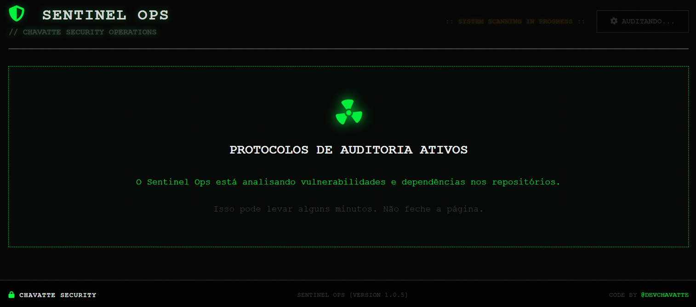
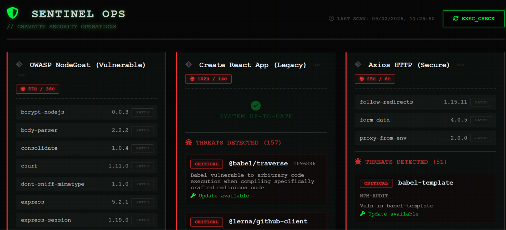
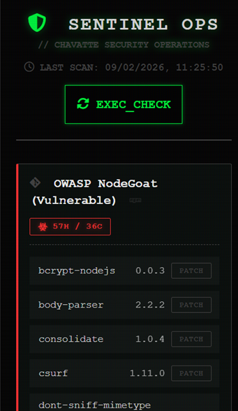
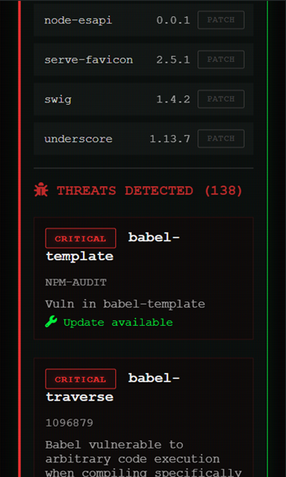

<pre style="font-size: 0.6rem;">

                              \\\\\\
                           \\\\\\\\\\\\
                          \\\\\\\\\\\\\\\
-------------,-|           |C>   // )\\\\|    .o88b. db   db  .d8b.  db    db  .d8b.  d888888b d888888b d88888b
           ,','|          /    || ,'/////|   d8P  Y8 88   88 d8' '8b 88    88 d8' '8b '~~88~~' '~~88~~' 88'  
---------,','  |         (,    ||   /////    8P      88ooo88 88ooo88 Y8    8P 88ooo88    88       88    88ooooo 
         ||    |          \\  ||||//''''|    8b      88~~~88 88~~~88 '8b  d8' 88~~~88    88       88    88~~~~~ 
         ||    |           |||||||     _|    Y8b  d8 88   88 88   88  '8bd8'  88   88    88       88    88.   
         ||    |______      ''''\____/ \      'Y88P' YP   YP YP   YP    YP    YP   YP    YP       YP    Y88888P
         ||    |     ,|         _/_____/ \
         ||  ,'    ,' |        /          |                 ___________________________________________
         ||,'    ,'   |       |         \  |              / \                                           \ 
_________|/    ,'     |      /           | |             |  |  A P I                                     | 
_____________,'      ,',_____|      |    | |              \ |      Portfolio Chavatte                    | 
             |     ,','      |      |    | |                |                        chavatte.42web.io   | 
             |   ,','    ____|_____/    /  |                |    ________________________________________|___
             | ,','  __/ |             /   |                |  /                                            /
_____________|','   ///_/-------------/   |                 \_/____________________________________________/ 
              |===========,'                                
			  

</pre>

<div align="center">


# 🛡️ Sentinel Ops

> **Chavatte Security Operations Center** <br>
> Monitor de Ameaças e Vulnerabilidades Avançado para Ecossistemas Node.js


O **Sentinel Ops** é uma ferramenta de Inteligência de Ameaças (Threat Intelligence) e auditoria de segurança contínua projetada para Home Labs, servidores CasaOS e equipes de DevSecOps. Ele monitora automaticamente seus repositórios Git, verifica árvores de dependências e alerta sobre vulnerabilidades de segurança (CVEs/GHSAs) através de um HUD Cyberpunk responsivo.

</div>

---

## ✨ Principais Funcionalidades

* **🕵️‍♂️ Compatibilidade Universal:** Detecta e audita de forma transparente ambientes **NPM**, **Yarn (Clássico e Berry v4+)** e **PNPM**.
* **🌐 Integração OSV-Scanner:** Realiza varreduras profundas e complementares usando o banco de dados `OSV.dev` do Google, capturando ameaças que escapam das auditorias nativas dos gerenciadores de pacotes.
* **🎯 Threat Intel Dinâmico:** Os cards de vulnerabilidade geram automaticamente links clicáveis para relatórios oficiais de mitigação (NIST NVD, GitHub Advisories, OSV).
* **📄 Exportação de Relatório de Ameaças:** Geração instantânea de relatórios táticos em formato Markdown (`.md`), contendo um Resumo Executivo e um Mapa de Exploração para facilitar o trabalho das equipes de Red/Blue Team.
* **⚡ Ultra Rápido (Sparse Checkout):** Não clona o repositório inteiro. Baixa apenas os arquivos de manifesto (`package.json`, `lockfiles`) com segurança para uma memória isolada.
* **🖥️ HUD Cyberpunk (UI/UX):** Dashboard visual em tempo real com efeitos de Glassmorphism, telemetria *Dual-Badge* e ordenação inteligente baseada em níveis de risco.
* **🔑 Suporte Híbrido:** Funciona nativamente com repositórios privados (via SSH) e públicos (via HTTPS).

---

## 🚀 Instalação Rápida (Docker Compose)

### 1. Estrutura de Pastas

Crie uma pasta para o projeto e dentro dela a seguinte estrutura:

```text
/sentinel-ops
├── docker-compose.yml
├── ssh/                # (Opcional) Suas chaves SSH privadas
└── config/
    └── repos.yml       # Lista de repositórios
```


### 2. Configuração (`docker-compose.yml`)

**YAML**

```
version: "3.8"
services:
  sentinel-ops:
    image: chavatte/sentinel-ops:latest
    container_name: sentinel-ops
    restart: unless-stopped
    ports:
      - "9393:8080"
    dns:
      - 8.8.8.8
      - 1.1.1.1
    environment:
      - SCAN_INTERVAL=21600 # Tempo em segundos (6 horas)
      - TZ=America/Sao_Paulo
    volumes:
      - ./config/repos.yml:/config/repos.yml:ro
      - ./ssh:/ssh:ro
      - sentinel_data:/data

volumes:
  sentinel_data:
```

### 3. Definindo os Repositórios (`config/repos.yml`)

Você pode misturar repositórios privados e públicos dinamicamente.

**YAML**

```
repos:
  # 🔐 Repositório Privado (Exige chave na pasta ./ssh)
  - id: meu-saas
    name: "Meu SaaS Privado"
    git: git@github.com:usuario/projeto-secreto.git
    ssh_key: /ssh/id_rsa

  # 🌍 Repositório Público (Não precisa de chave)
  - id: react-core
    name: "React (Open Source)"
    git: https://github.com/facebook/react.git
```

### 4. Executando

**Bash**

```
docker-compose up -d
```

Acesse o seu Dashboard SecOps em: `http://localhost:9393`

---

## 🛡️ Transparência SecOps & Segurança da Imagem Docker

Como uma ferramenta focada em segurança cibernética, o Sentinel Ops mantém rigorosa transparência sobre a sua própria cadeia de suprimentos ( *Supply Chain* ) de containers. Se você auditar nossa imagem Docker usando ferramentas como Docker Scout ou Trivy, poderá notar algumas CVEs sinalizadas. Estas vulnerabilidades estão mapeadas e são classificadas estritamente como  **Riscos Aceitos de Terceiros (Accepted Third-Party Risks)** :

* **Google OSV-Scanner (vulnerabilidades `golang`):** Nós buscamos o binário oficial mais recente do `osv-scanner` diretamente das *releases* do Google. Quaisquer CVEs relacionadas ao Golang sinalizadas neste binário são dependências upstream gerenciadas internamente pelo Google.
* **Alpine & NPM (`tar`, `minimatch`, etc.):** Nossa base utiliza a imagem fortificada `python:3.14-alpine` e força atualizações globais do NPM para minimizar a superfície de ataque. No entanto, algumas dependências transitórias atreladas ao ecossistema do gerenciador de pacotes do Sistema Operacional podem disparar alertas de nível baixo/moderado.

*Fique tranquilo: O Sentinel Ops é executado de forma estrita em subprocessos isolados. Esses falsos-positivos e alertas upstream não oferecem qualquer vetor de ataque que possa comprometer seus repositórios remotos ou a integridade do seu servidor host.*

---

## 🔑 Configuração de SSH (Para Repos Privados)

Se você precisa auditar repositórios privados (GitHub, GitLab, Bitbucket):

1. Copie sua chave privada (ex: `id_rsa`) para a pasta `./ssh`.
2. No `repos.yml`, o campo `ssh_key` deve apontar para `/ssh/nome-do-arquivo`.
3. **Segurança:** O Sentinel Ops copia sua chave para uma área temporária segura e aplica permissões restritas (`chmod 600`) automaticamente durante a execução.
4. *Não é necessário configurar arquivos `known_hosts` manualmente.*

---

## 🛠️ Desenvolvimento (Manual)

Se quiser rodar fora do Docker ou contribuir com o código:

**Pré-requisitos:** Python 3.11+, Git, Node.js, Corepack (Yarn/PNPM) e OSV-Scanner instalados.

**Bash**

```
# 1. Clone este repositório
git clone https://github.com/chavatte/sentinel-ops.git

# 2. Instale as dependências Python
pip install -r requirements.txt

# 3. Configure as variáveis de ambiente e rode
export CONFIG_FILE="./config/repos.yml"
python3 src/main.py
```

---

## 📸 Screenshots
| **Dashboard Desktop**                                  |
| ------------------------------------------------------------ |
|    |
|  |

| **Responsivo Mobile**                              | **Responsivo Mobile**                                 |
| -------------------------------------------------------- | ----------------------------------------------------------- |
|  |  |

---

## 📝 Licença

Este projeto é distribuído sob a licença  **MIT** . Consulte o arquivo `LICENSE` para mais detalhes.

---

CHAVATTE SECURITY

Desenvolvido por @DevChavatte